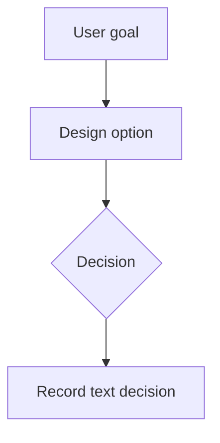

# Visual Companion Guide

## Lazy-load rule

Load this guide only after the user accepts the Visual Companion or when composing a visual artifact. `SKILL.md remains authoritative`; this file provides examples, accessibility guidance, and fallback details.

## When to use visuals

Use a visual when seeing the structure is clearer than reading prose:

- UI mockups, wireframes, navigation structures, layout comparisons
- Mermaid flowcharts, sequence diagrams, state diagrams, ER diagrams, timelines
- Architecture maps, data-flow diagrams, relationship maps
- Side-by-side visual options where spatial hierarchy matters

## When to stay text-only

Stay in terminal/chat text for conceptual or scope decisions:

- Requirements and constraints
- Tradeoff tables and approach selection
- Domain language such as "what does trust mean?"
- Questions where the answer is words rather than visual preference

## Mermaid and diagram examples

Keep diagrams small and include a text fallback.

Text fallback: "User goal leads to a design option, then a decision, then the decision is recorded in text."

## Mockups and comparisons

For mockups, show only the decision-relevant structure:

- 2-4 options maximum
- Use synthetic/redacted content
- State what question the visual answers
- Summarize each option in text before asking for feedback

## Accessibility and fallback

Every visual needs a concise text fallback. If Mermaid does not render, if the user is remote/headless, or if the visual would be hard to read, continue in text. Accept text-only feedback as primary.

## Privacy and safety

Never include secrets, credentials, tokens, private customer data, or PII in visuals. Use placeholders or synthetic examples.

## Stale visuals

If the user changes a decision after a visual was shown, retire or update the stale visual. The current text design remains the source of truth.
